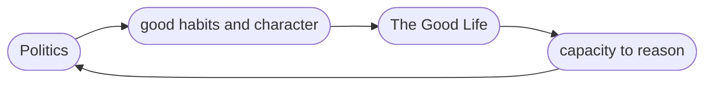

# Collective Action
## Human Nature
### Plato 
- 4 Cardinal virtues: **wisdom, courage, temperance, justice**
	- people who carried out these principles could carry out the Good society
### Athenians 
- About reason and philosophy
### Spartans
- Militaristic
	- Physical perfection put to military means
- they valued things like courage much higher
Human nature isn't just one black or white thing that can be written in a simple statement
## Self Interest, the Enlightenment, and institutions
Pre-Enlightenment, liberty was not about the individual but about the whole
cooperation is achievable, but not always easy or straightforward
- Two farmers draining a marsh thought experiment
Small groups of people requires a substantial amount of trust to cooperate however it is possible 
Larger groups of people requires that level of trust among everyone to cooperate making the odds slimmer
## Collective Action Institutions: Government
**collective action problem**: any situation where a group of people would be collectively better off if they could cooperate but find themselves unable to do so either because they cannot coordinate or because they have conflicting interests and goals
- Draining the marsh
### Solutions
**Selective Incentives, Political Entrepreneurs, ideologies/belief systems**
#### Selective Incentives
offers one path to widespread participation in the project by offering some kind of side benefit.
- Money or some form of compensation
- increased or decreased social standing
While selective incentives are able to solve the problem of collective action, they are **difficult to design and keep in appropriate bounds**
#### Political Entrepreneurs
someone deeply connected and interested who desperately wants the project to go forward—can help organize such an undertaking
- Politicians i.e. Samuel Adams organizing groups like the Sons of Liberty or the boycotts of tea
Entrepreneurs **require substantial trust and respect** in the community and in some situations there may be no significant political leadership capable of pulling everyone together
#### Ideologies/Belief systems
Having a common or shared belief
 if everyone is deeply committed to a particular PoV that implies working together the problem goes away
- Puritans moving to the Americas because of their shared beliefs
- Martin Luther King's non violent protests 
**Fragile and inconsistent solution**. An opposing ideology can destroy the unity. Ideologies like religion or nationalism are **difficult to create and not easily harnessed**
## Sovereignty, Legitimacy, & The Social Contract
**Sovereignty** - Power to make decisions in a particular place

John Locke believe that people could be reasonable and tolerant of people that hold different political and religious beliefs
- weld people and government together in a contractual relationship => **legislature**
**Political Legitimacy** - if the people delegated power to the government through collective action
- the powers of the government are delegated from the people

> The people would create a government capable of protecting themselves and their rights, and the government would gain great power, but be required to use that power legitimately. This was the **social contract**.

# Do We Own Ourselves? Libertarianism
## The Minimal State
Protects individual rights and property and keeps the peace. Anything more violates Libertarian legitimacy
The Libertarian reject three types of policies 
1. **No Paternalism**
	- Law to protect people from harming themselves
2. **No moral legislation**
	- using the law to promote a certain virtue or moral conviction among the majority
3. **No redistribution of wealth**
	- Laws to require people to help others.
	- left to the individual not the government
## Free Market Philosophy
Distributive justice depends on two requirements - **Justice in initial holdings** and **Justice in Transfers**
#### Justice in Initial Holdings 
Were the resources you used to make the money legitimately yours?
- If you sold stolen goods, you would not be entitled to any of the money made.
#### Justice in Transfer
If you made your money either through free exchanges in the market or from gifts voluntarily given to you 

If both requirements are meant you are entitled to what you have and the distribution of a free market are just no matter the inequality

Nozick argues that anyone that believes that an inequality of wealth is unjust will have to intervene in the free market repeatedly and continuously
- Intervening through taxation violates the voluntary transaction and individual's rights 
# Who Deserves What? Aristotle
## Justice, Telos, and Honor
1. **Justice is Teleological** - Defining rights requires us to figure out the telos of the social practice at hand
2. **Justice is Honorific** - To reason about the telos of a practice is to reason or argue what virtues it should honor or reward
Aristotle - Debates about Justice are debates about honor, virtue, and the nature of the good life

Justice is about things and the people that those things are given to
- equal persons should receive equal things
- Justice discriminates according to merit
	- The very best flute players should receive the best flutes
What values/merits do we judge by?
## What's the Purpose of Politics
Aristotle: To set up a framework of rights that is neutral among end. -> **to cultivate good character and form good citizens**
- Those who contribute the most and have greatest civic excellence gain the greatest share of political recognition and influence
## Can You Be a Good Person If You Don't Participate in Politics?
Men are political animals
- Our capacity to reason and deliberate uniquely sets apart from everything else in the world. To not use this capacity, would be like rejecting our humanity 
Happiness is not a state of mind but a way of being
## Politics and The Good Life

