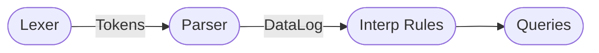

data log -> Lexer -> Tokens --> Parser --> Datalog --> Interp Rules --> Queries

```mermaid
flowchart LR;
A([Lexer]);
B([Parser]);
C([Interp Rules]);
D([Queries]);

A-->|Tokens|B
B-->|DataLog|C;
C-->D;
```

## Tokens
(ID, 'String', Line found on)
