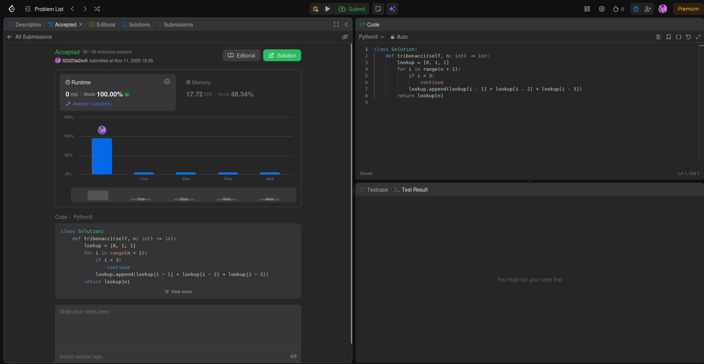

# Project Leetcode

## Baseline 

### Baseline Problem 1

Problem Name: *N-th Tribonacci Number*

[Submission Link](https://leetcode.com/problems/n-th-tribonacci-number/submissions/1827351408)



#### Time Complexity

```python 
class Solution:
    def tribonacci(self, n: int) -> int:
        lookup = [0, 1, 1]                  # O(1) - assigning is constant
        for i in range(n + 1):              # loop 1
            if i < 3:                       # O(1) - comparison is constant
                continue
            lookup.append(lookup[i - 1]     # O(1) - append is constant 
            + lookup[i - 2]                 # O(1) - array lookup is constant
            + lookup[i - 3])                # O(1) - array lookup is constant

return lookup[n]                            # O(1) - returning is constant
```
In `tribonacci` I use an iterative method and save the values to a lookup table. In order to find the nth tribonacci number, we have to 
find the values that it is dependent on. Loop 1 finds all the values of the tribonacci sequences before `n`. Therefore loop 1 has to iterate `n` times.

Overall, `tribonacci` is **O(n)** time complexity

#### Space Complexity

```python 
class Solution:
    def tribonacci(self, n: int) -> int:
        lookup = [0, 1, 1]                  # Array 1
        for i in range(n + 1):              # Loop 1
            if i < 3:   
                continue
            lookup.append(lookup[i - 1]     # O(1) - appending one element
            + lookup[i - 2] 
            + lookup[i - 3])

return lookup[n]                            # O(1) - returning is constant
```

----

### Baseline Problem 2

Problem Name: *fill me in*

[Submission Link]()


#### Time Complexity

*Fill me in*

#### Space Complexity

*Fill me in*

----

### Baseline Problem 3

Problem Name: *fill me in*

[Submission Link]()


#### Time Complexity

*Fill me in*

#### Space Complexity

*Fill me in*

----


## Core

### Core Problem 1

Problem Name: *fill me in*

[Submission Link]()


#### Time Complexity

*Fill me in*

#### Space Complexity

*Fill me in*

----

### Core Problem 2

Problem Name: *fill me in*

[Submission Link]()


#### Time Complexity

*Fill me in*

#### Space Complexity

*Fill me in*

----

### Core Problem 3

Problem Name: *fill me in*

[Submission Link]()


#### Time Complexity

*Fill me in*

#### Space Complexity

*Fill me in*

----

## Stretch 1

### Stretch 1 Problem 1

Problem Name: *fill me in*

[Submission Link]()


#### Time Complexity

*Fill me in*

#### Space Complexity

*Fill me in*

----

## Stretch 2

### Stretch 2 Problem 2

Problem Name: *fill me in*

[Submission Link]()


#### Time Complexity

*Fill me in*

#### Space Complexity

*Fill me in*

## Project Review

*Fill me in*
